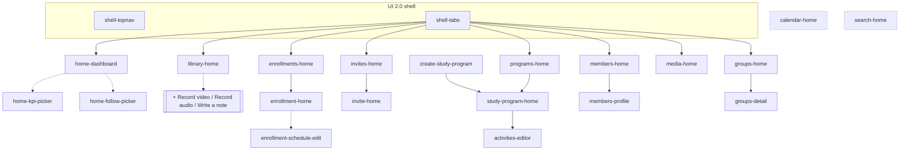
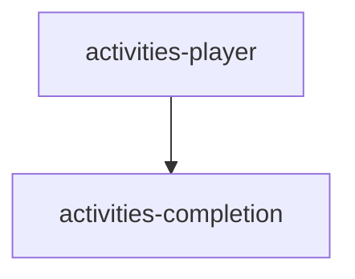

# UI 2.0 Screen Map

The navigation graph of the new UI: every screen (node) and every way to move between
screens (edge). Grown per screen spec — `/ui2-screen` phase 4 mirrors each spec's
§Connections here. Node ids match the README screen table (DECISIONS.md D8).

Two disconnected graphs by design (DECISIONS.md D1): the **iphone leader shell** and the
**web-member lesson runtime** share no navigation edges — they meet only at data (the same
server contract).

## iPhone leader shell

## Web member lesson runtime

## Edge table

One row per navigation edge; the trigger column carries the exact gesture/affordance from
the screen spec's §Connections. Overlay presentations are edges too (`overlay` kind).

| From | To | Kind | Trigger | Source spec |
|---|---|---|---|---|
| shell-tabs | home-dashboard | tab | tab select (default tab) | `screens/home-dashboard.md` §6 |
| home-dashboard | home-kpi-picker | overlay | Overview header plus (GlyphButton) | `screens/home-dashboard.md` §6 |
| home-dashboard | home-follow-picker | overlay | Following header plus (GlyphButton) | `screens/home-dashboard.md` §6 |
| home-dashboard | (deferred) | push? | Engagement header arrow-right — destination OQ-home-dashboard-1 | `screens/home-dashboard.md` §8 |
| home-dashboard | (deferred) | tap | GroupFollowCard tap + program ellipsis menu — OQ-home-dashboard-4 | `screens/home-dashboard.md` §8 |
| shell-tabs | members-home | tab | tab select (Members — evidenced by both specced frames) | `screens/members-home.md` §6 |
| shell-tabs | groups-home | tab | tab select (Groups) | `screens/groups-home.md` §6 |
| shell-tabs | enrollments-home | tab | tab select (Enrollments — active in the specced frame) | `screens/enrollments-home.md` §6 |
| enrollments-home | C-036 FilterMenuOverlay | overlay | any of the 4 filter chips | `screens/enrollments-home.md` §6 |
| enrollments-home | enrollment-home | push | EnrollmentProgressRow tap (resolves the row-tap half of OQ-enrollments-home-5, 2026-09-02) | `screens/enrollment-home.md` §6 |
| enrollments-home | (deferred) | push | GroupSectionHeader arrowRight — destination pending frames (OQ-enrollments-home-5, remaining half) | `screens/enrollments-home.md` §8 |
| enrollment-home | enrollment-schedule-edit | push | "Edit schedule" text-link (screen pending Figma) | `screens/enrollment-home.md` §6 |
| enrollment-home | (deferred) | push/tap | calendar glyph, day-card tap, lesson-card/slide taps (expected: activities-editor) — OQ-enrollment-home-1 | `screens/enrollment-home.md` §8 |
| invites-home | invite-home | push | invite row tap (invites-home pending-figma — entry surface added 2026-09-02) | `screens/invite-home.md` §6 |
| invite-home | members-profile | push | linked-member block tap (proposed via universal member entry — OQ-invite-home-6) | `screens/invite-home.md` §6 |
| invite-home | (deferred) | push | Sent group-invitation row chevron — OQ-invite-home-2 | `screens/invite-home.md` §8 |
| (creation affordance, undesigned) | create-study-program | push | program-create control — anticipated on **programs-home** (corrected from library-home 2026-09-05); the Programs card's nav add action is the other candidate (OQ-create-study-program-3 + OQ-C-019-2) | `screens/create-study-program.md` §6 |
| create-study-program | study-program-home | push | Create success (proposed destination, OQ-create-study-program-1; undesigned later steps may intervene, OQ-2) | `screens/create-study-program.md` §6 |
| groups-home | groups-detail | push | ListResultRow (Group+tags) tap | `screens/groups-home.md` §6 |
| members-home | members-profile | push | ListResultRow (Member) tap | `screens/members-home.md` §6 |
| (any member surface) | members-profile | push | **universal**: tapping any member anywhere opens members-profile (owner, 2026-09-01) — each future spec adds its concrete edge | `screens/members-profile.md` §6 |
| members-profile | shared-edit-field | push | any EditableFieldRow tap → that field's edit-screen instantiation (pattern) | `screens/shared-edit-field.md` §6 |
| (any C-042 host) | shared-edit-field | push | **pattern-wide**: every EditableFieldRow anywhere pushes its single-field edit screen | `screens/shared-edit-field.md` §6 |
| members-profile | (deferred) | tap | Membership/Engagement add pickers, group row tap — OQ-members-profile-2 | `screens/members-profile.md` §8 |
| shell-tabs | groups-home | tab | tab select | |
| shell-tabs | library-home | tab | tab select | |
| shell-tabs | invites-home | tab | tab select (Invites — resolves OQ-invite-home-1, 2026-09-05) | `design-system/components/C-019-top-nav.md` §2 |
| shell-tabs | programs-home | tab | tab select (Programs) | `design-system/components/C-019-top-nav.md` §2 |
| shell-tabs | media-home | tab | tab select (Media) | `design-system/components/C-019-top-nav.md` §2 |
| ~~shell-tabs~~ | calendar-home | ~~tab~~ | **no tab edge (2026-09-05)** — Calendar is not in the closed 8-tab set; entry surface unaccounted for | `design-system/components/C-019-top-nav.md` §2 |
| ~~shell-tabs~~ | search-home | ~~tab~~ | **no tab edge (2026-09-05)** — Search is not in the closed 8-tab set; entry surface unaccounted for | `design-system/components/C-019-top-nav.md` §2 |
| library-home | (3 creation flows, undesigned) | overlay? | the Library tab's nav add action → Record video / Record audio / Write a note (owner 2026-09-05); presentation undesigned, C-066 proposed — OQ-C-019-2/5 | `design-system/components/C-019-top-nav.md` §2b |
| programs-home | study-program-home | push | program row tap (**moved from library-home 2026-09-05** — the owner's Library ruling; the pushed presentation is proven by the C-040 back bar) | `screens/study-program-home.md` §6 |
| study-program-home | activities-editor | push | ActivityThumbnail tap (contract owned by activities-editor spec) | `screens/study-program-home.md` §6 |
| study-program-home | (deferred) | push/tap | header settings + export, Group Activity arrowRight, GroupEnrollmentCard tap — destinations pending frames (OQ-study-program-home-3) | `screens/study-program-home.md` §8 |
| activities-player | activities-completion | page | pager reaches final page | |

## Dependency notes (which screens must be specced first)

Mirrored in the README Spec queue — the queue is authoritative; this section only records
*why* an ordering exists (e.g. `shell-topnav` mints the nav primitives every tab root
consumes; `activities-player` mints the pager rows `activities-editor` reuses).
